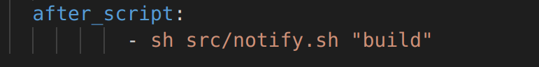

## Задание 1 Установка

Регистрация раннера

Проверка установки раннера

## Задание 2 Сборка

Код yaml файла

Сборка проекта

Артефакта оставшиеся после сборки

## Задание 3 Тест кодстайла

Код yaml файла

Успешный тест

Тест с стилестическими ошибками

Успешный пайплайн

## Задание 4 Интеграционные тесты

Код yaml файла

Успещный пайплайн

Ошибка в коде (в структуре флаги изначально 1)

Заваленный райплайн

## Задание 5 Этап деплоя

Код yaml файла

Баш скрипт для копирования файлов

Пушим измененный yml и скрипт copy.sh, пайплайн проходит и ожидает ручного запуска:

Деплой прошёл успешно, файлы появились в нужной папке на второй машине:

## Задание 6  Уведомления

Регистрация бота

Написание скипта для отправки уведомлений

Добавление запуска скрипта после каждой стадии

Уведомления от бота

